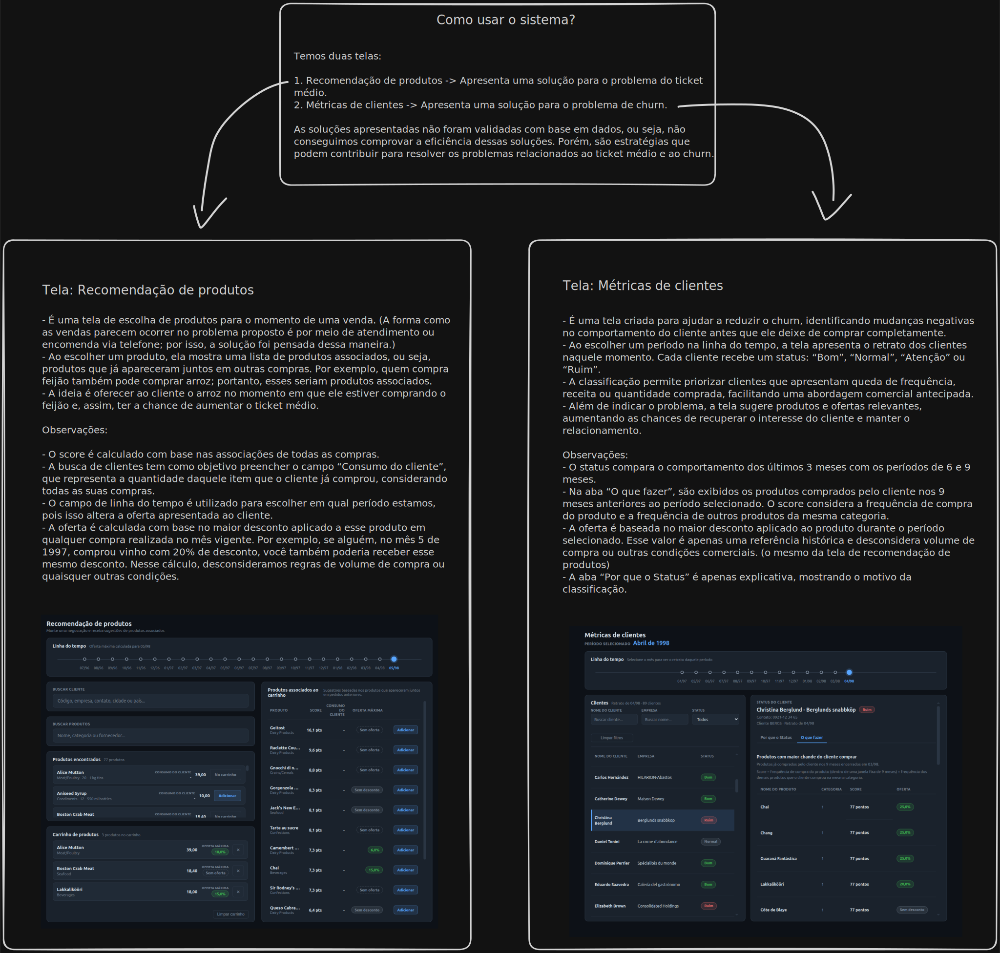

# Northwind — pipeline de dados e viewer

Este projeto transforma os dados de vendas da base Northwind em informações que podem apoiar duas decisões comerciais: **aumentar o ticket médio** e **reduzir o risco de churn**. Para isso, os arquivos brutos passam por um pipeline de tratamento e cálculo; depois, os resultados são exportados para um banco SQLite consumido por um viewer web.

O sistema possui duas telas principais:

- **Recomendação de produtos:** ajuda o atendente a oferecer itens que costumam ser comprados junto com os produtos escolhidos pelo cliente.
- **Métricas de clientes:** acompanha mudanças no comportamento de compra, classifica cada cliente e sugere uma possível ação comercial.

> As estratégias apresentadas são hipóteses de negócio. Elas não foram validadas por experimento ou por medição de resultado e, portanto, não comprovam aumento de ticket médio ou redução de churn.

## Visão geral



O fluxo de dados é:

```text
CSV (Bronze)
    ↓ limpeza, tipagem e validação
Parquet (Silver)
    ↓ agregações e regras de negócio
Parquet (Gold)
    ↓ exportação
SQLite (viewer/data.sqlite)
    ↓ consultas executadas no navegador com SQL.js
Viewer web
```

O projeto usa Python com o backend DuckDB do SQLFrame para executar as transformações com uma API semelhante à do Spark. O viewer é uma aplicação estática feita com HTML, CSS e JavaScript, sem servidor de aplicação: o banco SQLite é carregado e consultado diretamente no navegador.

## Estrutura do repositório

```text
.
├── data/
│   ├── bronze/       # arquivos CSV de origem
│   ├── silver/       # dados tratados em Parquet
│   └── gold/         # tabelas analíticas em Parquet
├── documents/
│   └── prompts/      # prompts usados na evolução do sistema
├── pipeline/
│   ├── jobs/         # jobs de transformação e exportação
│   └── logs/         # logs locais das execuções
└── viewer/
    ├── docs/         # diagrama, imagens e documentação funcional
    ├── lib/          # SQL.js e WebAssembly
    ├── data.sqlite   # banco consumido pelo viewer
    ├── index.html
    ├── bi.js
    ├── vendas.js
    └── metricas-clientes.js
```

## Pipeline de dados

### Bronze

A camada Bronze contém os CSVs originais da Northwind. Neste repositório, esses arquivos já são a entrada do pipeline; não há um job anterior responsável por obtê-los.

### Silver

A camada Silver converte os principais arquivos para Parquet, corrige tipos, calcula campos auxiliares e valida regras básicas de integridade.

| Tabela | Finalidade |
|---|---|
| `customers` | Cadastro tratado e único de clientes. |
| `orders` | Pedidos com datas, cliente, frete e demais campos tipados. |
| `products` | Catálogo tratado de produtos. |
| `order_details` | Itens dos pedidos, incluindo a receita do item após desconto. |

Os jobs interrompem a execução quando encontram problemas como identificadores nulos ou duplicados, preços negativos e referências inválidas.

### Gold

A camada Gold prepara os dados para uso analítico e para as duas telas.

| Tabela | Uso principal |
|---|---|
| `clientes` | Dados cadastrais exibidos nas buscas e listas. |
| `produtos` | Catálogo enriquecido com categoria e fornecedor. |
| `descontos` | Maior desconto observado por produto em cada mês. |
| `produtos_associados` | Pares de produtos que apareceram juntos em pedidos. |
| `ticket_medio` | Resumo mensal das vendas. |
| `historico_cliente_produtos` | Consumo mensal por cliente e produto. |
| `historico_cliente_volume` | Frequência e receita mensal por cliente. |
| `historico_cliente_metricas` | Retrato mensal das métricas de cada cliente em três blocos de três meses. |

As tabelas Gold são gravadas em Parquet e exportadas para `viewer/data.sqlite`. As tabelas históricas podem ter vários arquivos mensais; o exportador reúne esses arquivos em uma única tabela SQLite.

## Tela de recomendação de produtos

Essa tela foi pensada para apoiar uma venda feita por atendimento ou encomenda. O atendente seleciona produtos para o carrinho, e o sistema sugere outros itens que já apareceram junto com eles em pedidos anteriores. A ideia é oferecer uma combinação relevante durante a negociação e criar uma oportunidade de aumentar o ticket médio.

### Como as sugestões são calculadas

Para cada produto do carrinho, o sistema procura os produtos comprados junto com ele e calcula a força da associação com base em todos os pedidos disponíveis. Quando um mesmo produto é sugerido por mais de um item do carrinho, as associações são combinadas. O score é um índice de priorização, não uma probabilidade garantida de compra.

O cálculo também aplica uma pequena penalização quando a associação normalmente ocorreu em pedidos que continham outros produtos. Isso reduz a prioridade de pares cuja relação pode depender de um terceiro item.

### Cliente, consumo e oferta

- A busca de clientes preenche o campo **Consumo do cliente**, que representa quanto aquele cliente já comprou do produto em todo o histórico disponível. Esse valor é apenas informativo e não altera o score.
- A linha do tempo define o mês usado na oferta.
- A **Oferta máxima** corresponde ao maior desconto observado para aquele produto no mês selecionado.
- A oferta é uma referência histórica: ela não considera margem, estoque, volume comprado nem outras condições comerciais.

## Tela de métricas de clientes

Essa tela foi criada para ajudar a reduzir o churn por meio da identificação de mudanças negativas antes que o cliente deixe de comprar completamente. Ao escolher um mês na linha do tempo, o usuário vê o retrato daquele período, seleciona um cliente e consulta o motivo de sua classificação e uma sugestão de abordagem comercial.

### As cinco métricas

Cada retrato contém cinco métricas apresentadas na aba **Por que o Status**:

1. frequência de compra;
2. média de receita;
3. média de desconto;
4. média de itens variados;
5. média de quantidade.

O histórico é dividido em três faixas independentes de três meses:

- **3m:** os três meses mais recentes;
- **6m:** os três meses imediatamente anteriores à faixa 3m;
- **9m:** os três meses mais antigos, imediatamente anteriores à faixa 6m.

Assim, os sufixos indicam a distância da faixa em relação ao período atual; não representam médias acumuladas de 3, 6 e 9 meses. Meses sem compra entram no cálculo com valor zero.

A frequência é a proporção de meses da faixa em que houve pelo menos uma compra. As médias de receita, variedade e quantidade são divididas pelos três meses da faixa. O desconto é ponderado pelo valor bruto comprado.

### Tendência de cada métrica

A faixa mais recente, `3m`, é comparada separadamente com `6m` e `9m`. A média dessas duas variações define a tendência da métrica:

```text
índice de tendência = (variação de 3m contra 6m + variação de 3m contra 9m) / 2
```

Para frequência e desconto, a variação é a diferença direta em pontos percentuais. Para receita, itens variados e quantidade, usa-se a variação relativa em relação ao valor da faixa comparada.

Com tolerância de 20%:

- acima de `+20%`: **Aumentou**;
- abaixo de `-20%`: **Diminuiu**;
- entre os limites, incluindo exatamente `-20%` e `+20%`: **Normal**.

### Status geral do cliente

O status geral usa frequência, receita e quantidade. Desconto e variedade aparecem como contexto, mas não definem sozinhos a classificação.

| Status | Regra |
|---|---|
| **Ruim** | Pelo menos duas entre frequência, receita e quantidade diminuíram. |
| **Atenção** | Não é Ruim, mas a frequência ou a receita diminuiu. |
| **Bom** | Não se enquadra nas regras anteriores e frequência e receita aumentaram. |
| **Normal** | Nenhuma das regras anteriores foi atendida. |

A precedência é `Ruim → Atenção → Bom → Normal`.

### Abas de detalhes

Na aba **Por que o Status**, o viewer apresenta os gráficos mensais de frequência e receita e explica o comportamento das cinco métricas, incluindo os valores das faixas, as duas comparações e o índice médio.

Na aba **O que fazer**, são listados os produtos comprados pelo cliente em uma janela fixa de nove meses encerrada no mês anterior ao período selecionado. Para cada produto:

- a frequência corresponde ao percentual desses nove meses em que o produto foi comprado;
- o score soma a frequência do próprio produto às frequências dos demais produtos da mesma categoria comprados pelo cliente;
- a oferta é o maior desconto observado para o produto no período selecionado.

A lista é ordenada pelo maior score, depois pela maior oferta e, em caso de empate, pelo nome do produto. Essa recomendação é uma pista para a abordagem comercial, não uma previsão de compra.

## Como executar

Execute os comandos a partir da raiz do repositório. O projeto utiliza o ambiente virtual local `.venv`; o repositório ainda não possui um arquivo de manifesto de dependências, portanto esse ambiente precisa conter o `sqlframe` com suporte ao backend DuckDB.

### 1. Gerar a camada Silver

```bash
.venv/bin/python pipeline/jobs/bronze_to_silver_customers/job.py
.venv/bin/python pipeline/jobs/bronze_to_silver_orders/job.py
.venv/bin/python pipeline/jobs/bronze_to_silver_products/job.py
.venv/bin/python pipeline/jobs/bronze_to_silver_order_details/job.py
```

`order_details` deve ser executado depois de `orders`, pois valida se os pedidos referenciados existem na Silver.

### 2. Gerar e exportar as tabelas Gold

```bash
.venv/bin/python pipeline/jobs/silver_to_gold_clientes/job.py
.venv/bin/python pipeline/jobs/silver_to_gold_produtos/job.py
.venv/bin/python pipeline/jobs/silver_to_gold_produtos_associados/job.py
.venv/bin/python pipeline/jobs/silver_to_gold_ticket_medio/job.py
.venv/bin/python pipeline/jobs/silver_to_gold_historico_cliente/job.py
```

Cada orquestrador cria suas tabelas Gold e já as exporta para o SQLite do viewer.

### 3. Gerar os retratos mensais de métricas

O histórico de métricas é gerado separadamente, um mês por execução. A data informada é a data de processamento; o retrato criado corresponde ao mês fechado imediatamente anterior.

```bash
.venv/bin/python pipeline/jobs/silver_to_gold_historico_cliente/historico_cliente_metricas.py --data-processamento 1998-05-01
.venv/bin/python pipeline/jobs/gold_to_db_export_data/job.py historico_cliente_metricas
```

Nesse exemplo, a primeira linha gera o retrato de `1998-04`. Depois de criar os meses desejados, a segunda linha exporta todo o histórico existente para o SQLite.

Também é possível exportar novamente qualquer tabela Gold:

```bash
.venv/bin/python pipeline/jobs/gold_to_db_export_data/job.py produtos
```

### 4. Abrir o viewer

Como o navegador precisa carregar o banco e o arquivo WebAssembly, abra o viewer por um servidor HTTP local, não diretamente pelo sistema de arquivos.

```bash
cd viewer
python3 -m http.server 8080
```

Depois, acesse [http://localhost:8080](http://localhost:8080).

## Logs e validações

Os jobs exibem o andamento no terminal e gravam logs em `pipeline/logs/`. Antes de substituir uma saída, cada transformação valida as principais chaves e regras de integridade. Se uma validação falhar, o job termina com erro para evitar a publicação de uma tabela inconsistente.

## Publicação do viewer

O diretório `viewer/` é autocontido e pode ser publicado como site estático. Em uma configuração da Vercel, por exemplo, ele pode ser definido como **Root Directory**, sem comando de build e com a saída servida a partir do próprio diretório. O arquivo `data.sqlite` precisa acompanhar a publicação.

## Documentação visual

- [Como usar o sistema](viewer/docs/sistema.md)
- [Diagrama em SVG](viewer/docs/sistema.svg)
- [Prompts de construção e correção](documents/prompts/)

